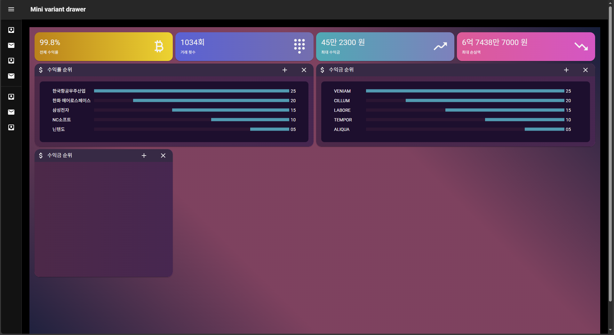

# 주요 목차

0. 환경 설정
1. 리액트 주요 기능
2. 세부 기능

## 0. 환경 설정
 - 설치
```bash
yarn create react-app react-research --template typescript
yarn add @mui/material @emotion/react @emotion/styled
yarn add @mui/icons-material @mui/material @emotion/styled @emotion/react
yarn add d3 @types/d3
```

## 리액트 주요 기능


## 세부 기능


## 스크린샷

- 2025.04.06 dashboard

